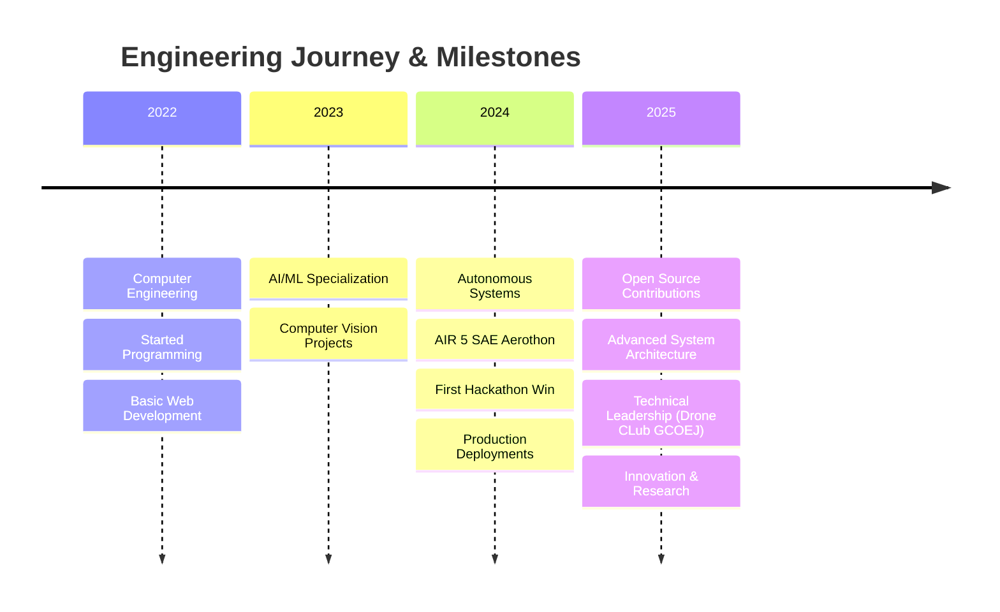

<div align="center">
  
</div>

<div align="center">
  
</div>

<br/>

<div align="center">
  <a href="https://github.com/Shubham07badgujar">
    
  </a>
  <a href="https://github.com/Shubham07badgujar?tab=followers">
    
  </a>
  <a href="https://github.com/Shubham07badgujar?tab=repositories">
    
  </a>
</div>

## 🧑‍💻 Professional Summary

```yaml
name: Shubham Badgujar
role: Computer Engineering Student & AI Developer
location: Government College of Engineering, Jalgaon
focus: AI-Powered Systems for Real-World Problem Solving
specialization: [Computer Vision, Autonomous Systems, Full Stack Development]
current_status: Building Next-Gen Solutions
```

### 🚀 Current Engineering Projects

<table>
<tr>
<td width="50%">

**🛰️ Autonomous Drone Systems**
- Advanced surveillance & disaster management
- Mission Planner & DroneKit integration
- Real-time computer vision processing
- *Achieved AIR 5 in SAE Aerothon 2024*

</td>
<td width="50%">

**🤖 AI Wellness Assistant**
- CLI-based health monitoring system
- Aligned with UN SDG 3 principles
- Machine learning-powered insights
- *Production-ready deployment*

</td>
</tr>
<tr>
<td>

**🌾 Smart Agriculture Platform**
- Computer Vision crop analysis
- FastAPI backend architecture
- Blockchain integration for traceability
- *IoT sensor data processing*

</td>
<td>

**🔬 Open Source Contributions**
- Active Kaggle competitor
- Multiple hackathon victories
- Community-driven AI projects
- *Technical documentation & tutorials*

</td>
</tr>
</table>

### 💡 Core Technical Competencies

<details>
<summary><b>🧠 Artificial Intelligence & Machine Learning</b></summary>
<br>

- **Computer Vision**: YOLOv8, OpenCV, Image Processing, Object Detection
- **Deep Learning**: Neural Networks, CNNs, RNNs, Transfer Learning
- **MLOps**: Model Deployment, Version Control, Pipeline Automation
- **Data Science**: Pandas, NumPy, Scikit-learn, Statistical Analysis

</details>

<details>
<summary><b>🤖 Autonomous Systems Development</b></summary>
<br>

- **Drone Technology**: Mission Planner, DroneKit, ArduPilot
- **Robotics**: Path Planning, SLAM, Sensor Fusion
- **Real-time Processing**: Edge Computing, Embedded Systems
- **Control Systems**: PID Controllers, State Machines

</details>

<details>
<summary><b>🌐 Full Stack Engineering</b></summary>
<br>

- **Frontend**: React.js, JavaScript (ES6+), HTML5, CSS3, Responsive Design
- **Backend**: Node.js, FastAPI, RESTful APIs, Microservices Architecture
- **Databases**: MongoDB, MySQL, Database Design & Optimization
- **DevOps**: AWS, Docker, CI/CD Pipelines, Version Control (Git)

</details>

### 🏆 Professional Achievements & Recognition

<div align="center">

| 🏅 Achievement | 📊 Impact | 🗓️ Year |
|:---|:---|:---:|
| **AIR 5 - SAE Aerothon 2024** | National Level Drone Competition | 2024 |
| **Smart Agriculture Winner** | Multiple Hackathons | 2023-24 |
| **Open Source Contributor** | Active Community Participation | Ongoing |
| **Kaggle Competitions** | Data Science & ML Challenges | 2023-24 |

</div>

### 🌐 Professional Network & Contact

<div align="center">

[](https://www.linkedin.com/in/shubham-badgujar-05b97425b/)
[](mailto:shubhambadgujari076@gmail.com)
[](https://discord.com/channels/@me)
[](#)

</div>

### 🛠️ Technology Arsenal & Development Stack

<div align="center">

#### **Programming Languages**


#### **AI/ML & Data Science**


#### **Web Development & Frameworks**


#### **Databases & Cloud Services**


#### **Development Tools & Platforms**


</div>

## 📊 Performance Analytics & Development Metrics

<div align="center">
  
  
  
  
</div>

<div align="center">
  
  
  
</div>

### 📈 Contribution Graph & Activity Timeline

<div align="center">
  
  
  
</div>

### 🏆 Achievement Showcase & Recognition

<div align="center">
  
  
  
</div>

### 💼 Professional Development Timeline



### 🎯 Current Focus Areas & Future Roadmap

<table>
<tr>
<td align="center" width="25%">

<br><b>AI Research</b>
<br>Advanced ML Models
</td>
<td align="center" width="25%">

<br><b>Autonomous Systems</b>
<br>Drone Technology
</td>
<td align="center" width="25%">

<br><b>Full Stack</b>
<br>System Architecture
</td>
<td align="center" width="25%">

<br><b>Open Source</b>
<br>Community Impact
</td>
</tr>
</table>

---

<div align="center">
  
**"Innovating at the intersection of AI, Autonomous Systems, and Full-Stack Development"**


[](https://visitcount.itsvg.in)

</div>

<!-- Development Notes: Enhanced with professional styling, technical vocabulary, and visual elements optimized for GitHub's Markdown renderer -->
